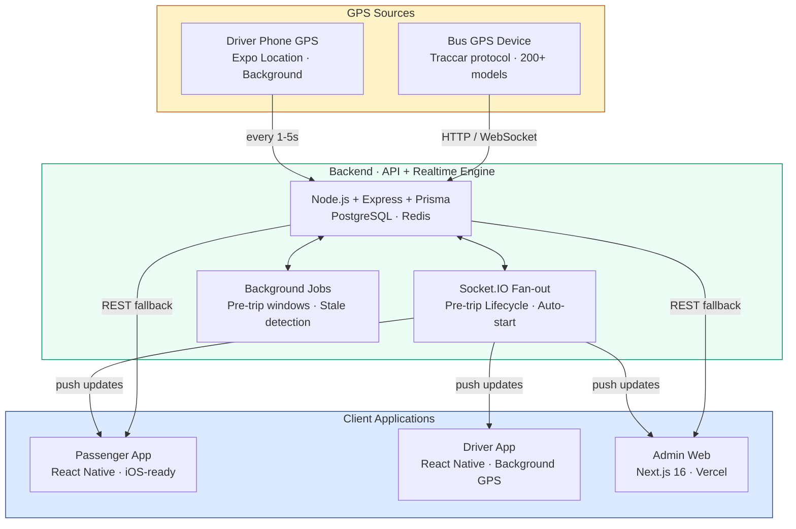
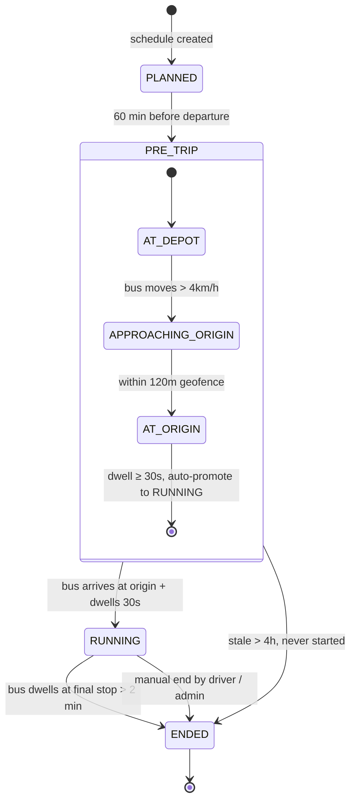
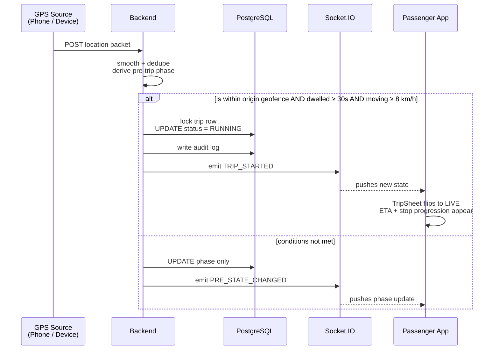

# UniBus Live

> A production-grade, real-time university bus tracking platform — passenger app, driver app, web admin, and GPS hardware unified into one bilingual system.

<p align="center">
  
</p>

<p align="center">
  <strong>NPI University of Bangladesh · Department of Computer Science &amp; Engineering</strong><br/>
  <em>Final Year Project · NPIUB Project Fair 2026</em>
</p>

<p align="center">
  <a href="#posters">Posters</a> ·
  <a href="#architecture">Architecture</a> ·
  <a href="#features">Features</a> ·
  <a href="#tech-stack">Stack</a> ·
  <a href="#screenshots">Screenshots</a> ·
  <a href="#project-structure">Structure</a> ·
  <a href="#team">Team</a>
</p>

---

## Table of Contents

1. [About the Project](#about-the-project)
2. [The Problem We Solve](#the-problem-we-solve)
3. [Live Demo &amp; Distribution](#live-demo--distribution)
4. [Posters](#posters)
5. [Features](#features)
6. [Architecture](#architecture)
7. [Trip Lifecycle](#trip-lifecycle)
8. [Auto-Start Sequence](#auto-start-sequence)
9. [Tech Stack](#tech-stack)
10. [Project Structure](#project-structure)
11. [Admin Web Dashboard](#admin-web-dashboard)
12. [Screenshots](#screenshots)
13. [Getting Started Locally](#getting-started-locally)
14. [Deployment](#deployment)
15. [Pilot &amp; Production](#pilot--production)
16. [Future Scope](#future-scope)
17. [Team](#team)
18. [Acknowledgements](#acknowledgements)

---

## About the Project

UniBus Live answers a simple question every university student asks every morning: **"Where's my bus?"** The platform fuses driver-phone GPS, hardware GPS devices, and a real-time backend into one polished, bilingual experience — for passengers, drivers, and administrators.

| What it is | What it isn't |
|---|---|
| A production-grade, deployed system | A prototype or coursework demo |
| One unified platform across mobile + web | Three separate apps glued together |
| Pilot-tested with real students | Lab-tested under ideal conditions |
| Bilingual (English + বাংলা) from day one | English-only with translations bolted on later |
| Hybrid GPS (phone + hardware) | Single-source-of-truth GPS |

### Key numbers

| | |
|:-:|:-:|
| **&lt; 2s** | Live update latency |
| **3** | Unified platforms (Passenger, Driver, Admin) |
| **2** | Languages — English &amp; বাংলা |
| **60 min** | Pre-trip visibility horizon |
| **~ 50 MB** | Android APK size (arm64-only, ProGuard) |
| **24/7** | Backend uptime (PM2 on Webuzo VPS) |

---

## The Problem We Solve

Before UniBus Live, students at NPIUB (and most universities) faced:

- **Blind waiting** at stops with no idea when the bus would arrive
- **Stale WhatsApp groups** with fragmented, contradictory information
- **No central dashboard** for admins to manage fleet, routes, or trips
- **English-only transit tools** that excluded a large portion of users
- **Driver delays uncommunicated** to passengers

Our solution makes the bus's location, status, and timing visible to everyone — in real time, in their own language, on their own phone.

---

## Live Demo &amp; Distribution

| What | Where |
|---|---|
| Web Admin | `https://bus-tracking-frontend-woad.vercel.app` |
| Backend API | `https://api.nrtechvps.com/api/v1` |
| Passenger APK | EAS build link (latest: v1.0.6) |
| Driver APK | EAS build link (latest: v1.0.6) |
| Posters (Full + App) | See [Posters](#posters) section below |

> Replace placeholder URLs with your live links before sharing.

---

## Posters

We've built two professional A1-portrait (20 × 30 inch) posters for the NPIUB Project Fair 2026:

| Poster | Focus | View |
|---|---|---|
| Poster 1 — Full Project Overview | End-to-end platform: passenger app + driver app + admin web + GPS pipeline + architecture | [`poster-1-full-project.html`](./poster-1-full-project.html) |
| Poster 2 — Mobile App Overview | The passenger app in detail: user flow, features, UX, tech stack | [`poster-2-app-overview.html`](./poster-2-app-overview.html) |

### How to view

- **Quick preview:** open either HTML file in Chrome.
- **Print-ready PDF:** Chrome → `Ctrl+P` → Save as PDF → Paper size: Custom 20 × 30 in → Margins: None → Background graphics: **ENABLED**.
- **Print at scale:** take the resulting PDF to any print shop and ask for *"20 × 30 inch poster, matte or semi-gloss."*

---

## Features

### For Passengers (Mobile App)

- [x] Real-time bus tracking with sub-2-second updates
- [x] Pre-trip visibility — see the bus 60 minutes before it departs
- [x] Smart stop alerts — push notifications before bus reaches your stop
- [x] Multi-day schedules — Today / Tomorrow / All days
- [x] Trip history + personal stats — last 30 days + streak count
- [x] Hybrid map view — standard / satellite + Google traffic layer
- [x] Bilingual interface — English + বাংলা everywhere
- [x] Forgot-password recovery — 3-step OTP flow
- [x] Offline tolerance — banner only when data truly stale
- [x] Quiet hours for notifications

### For Drivers (Mobile App)

- [x] Background location streaming during active trips
- [x] Foreground service for reliable GPS even with screen off
- [x] Manual trip start / end with confirmation
- [x] Pre-trip phase visibility
- [x] Battery-aware location accuracy

### For Admins (Web Dashboard)

- [x] Passenger registration approval workflow
- [x] Fleet management — buses, drivers, capacity, plates
- [x] Visual route editor — polylines + ordered stops
- [x] Schedule management — per-day departure times with AM/PM picker
- [x] GPS device management — Traccar-managed or Direct-ingest
- [x] Live operations dashboard — real-time trip view
- [x] Manual trip control — start/end any trip
- [x] Service alerts — broadcast announcements to all passenger apps
- [x] Analytics dashboard — usage stats and trends
- [x] Audit log viewer — tamper-proof change history

---

## Architecture



### What each layer does

| Layer | Role |
|---|---|
| **GPS sources** | Driver phones via Expo Location's background-mode foreground service, OR hardware GPS devices via the Traccar protocol (compatible with 200+ device models). |
| **Backend API + realtime** | Node.js + Express handles REST. Socket.IO fans out live updates to subscribers. Prisma + PostgreSQL is the data layer. Redis powers the Socket.IO adapter for horizontal scaling. |
| **Background jobs** | `preTripWindow.job.ts` opens trip rows 60 min before departure. `telematicsLifecycle.service.ts` auto-starts trips when buses arrive at origins. `tripStale.service.ts` retires abandoned trips. |
| **Clients** | Passenger and Driver apps share a React Native + Expo codebase. Admin web is Next.js 16 on Vercel. |

---

## Trip Lifecycle

Every trip moves through a deterministic state machine. No state is ever skipped — even on socket disconnect, polling catches up.



### What each phase shows to the passenger

| Phase | Banner shown |
|---|---|
| `AT_DEPOT` | *"Bus is parked at the depot"* with a calm bed icon |
| `APPROACHING_ORIGIN` | *"Bus is on the way — 450m to the start point"* with pulsing navigate icon |
| `AT_ORIGIN` | *"Bus has arrived at the start — boarding soon"* with success checkmark |
| `RUNNING` | Live map + ETA + stop progression with passed-stop checkmarks |
| `ENDED` | Calm "Trip ended" hero |

---

## Auto-Start Sequence

When the platform decides to auto-promote a `PRE_TRIP` to `RUNNING`:



### Auto-start guards (all must be true)

| Guard | Configurable | Default |
|---|---|---|
| `TELEMATICS_AUTO_START_ENABLED` | yes | `true` |
| Source must be `HEALTHY` | yes | `true` |
| Schedule exists within ±30/45 min of departure | yes | yes |
| Bus within 400m of route's first stop | yes | `400` |
| Movement confirmed (≥ 8 km/h in 2+ samples OR 60m in 20s) | yes | yes |
| No existing `PRE_TRIP` / `RUNNING` trip for this bus | hard rule | — |

---

## Tech Stack

### Backend

| Layer | Technology |
|---|---|
| Runtime | Node.js 20+ |
| HTTP framework | Express |
| Database | PostgreSQL 15+ |
| ORM | Prisma 7 |
| Realtime | Socket.IO + Redis adapter |
| Process manager | PM2 |
| Host | Webuzo VPS |
| Auth | JWT (access + refresh) with rotation |
| Logging | Pino (JSON structured) |
| Rate limiting | express-rate-limit |

### Web Admin

| Layer | Technology |
|---|---|
| Framework | Next.js 16 (App Router) |
| Language | TypeScript (strict) |
| Styling | Tailwind CSS |
| Hosting | Vercel (Edge) |
| Maps | Google Maps JS SDK |

### Mobile (Passenger + Driver)

| Layer | Technology |
|---|---|
| Framework | React Native 0.85 |
| Toolkit | Expo SDK 56 |
| JS engine | Hermes (AOT) |
| Realtime | Socket.IO client |
| Maps | react-native-maps + Google Maps SDK |
| Push notifications | Expo Notifications + native channels |
| Location | Expo Location (background, foreground service) |
| Storage | Expo SecureStore |
| Distribution | EAS Build with ProGuard + arm64 ABI split |

### GPS Hardware

| Layer | Technology |
|---|---|
| Protocol | Traccar (200+ device models supported) |
| Ingest modes | Traccar-managed (poll + WebSocket) OR Direct (device posts to backend) |

---

## Project Structure

```text
unibus-live/
├── bus-tracking-backend/          # Node.js API + realtime engine
│   ├── prisma/
│   │   └── schema.prisma          # Database schema
│   ├── src/
│   │   ├── config/                # env, prisma, logger
│   │   ├── controllers/           # Express route handlers
│   │   ├── middlewares/           # auth, rate limit, validation
│   │   ├── routes/                # API surface
│   │   ├── services/              # Business logic
│   │   │   ├── auth.service.ts
│   │   │   ├── trip.service.ts
│   │   │   ├── telematicsLifecycle.service.ts
│   │   │   ├── preTripWindow.service.ts
│   │   │   ├── preTripPhase.service.ts
│   │   │   ├── gpsIngest.service.ts
│   │   │   ├── schedulesToday.service.ts
│   │   │   ├── notification.service.ts
│   │   │   ├── pushNotification.service.ts
│   │   │   ├── traccar.service.ts
│   │   │   ├── traccarPoll.job.ts
│   │   │   └── traccarRealtime.service.ts
│   │   ├── sockets/               # Socket.IO event handlers
│   │   ├── utils/                 # geo, dayType, cors
│   │   └── server.ts              # bootstrap + graceful shutdown
│   ├── .env                       # secrets (gitignored)
│   ├── package.json
│   └── ecosystem.config.cjs       # PM2 config
│
├── bus-tracking-frontend/         # Next.js web + Expo mobile monorepo
│   ├── src/                       # Next.js admin web
│   │   ├── app/                   # App Router pages
│   │   │   └── (dashboard)/
│   │   │       └── admin/
│   │   │           ├── users/
│   │   │           ├── fleet/
│   │   │           ├── routes/
│   │   │           ├── schedules/
│   │   │           ├── gps-devices/
│   │   │           ├── service-alerts/
│   │   │           ├── trips/
│   │   │           ├── analytics/
│   │   │           └── audit/
│   │   ├── features/              # feature-grouped modules
│   │   └── lib/                   # shared utilities
│   │
│   └── mobile/                    # Expo monorepo
│       ├── apps/
│       │   ├── passenger/         # Passenger Expo app
│       │   │   ├── src/
│       │   │   │   ├── screens/   # Live, Schedules, Profile…
│       │   │   │   ├── components/
│       │   │   │   ├── features/
│       │   │   │   │   ├── journey/
│       │   │   │   │   └── passenger/
│       │   │   │   └── navigation/
│       │   │   ├── plugins/       # Custom Expo config plugins
│       │   │   └── app.config.js
│       │   └── driver/            # Driver Expo app
│       │       └── src/
│       └── packages/
│           └── shared/            # Shared UI + APIs + i18n
│               └── src/
│                   ├── ui/        # Reusable components
│                   ├── lib/
│                   │   ├── api/
│                   │   ├── auth/
│                   │   └── socket/
│                   ├── i18n/      # English + Bengali strings
│                   └── theme/
│
└── posters/                       # This folder — fair posters + README
    ├── README.md                  # You are here
    ├── index.html                 # Landing page
    ├── poster-1-full-project.html
    ├── poster-2-app-overview.html
    ├── npi-logo.png
    └── screenshots/
        ├── live.png
        ├── schedules.png
        ├── stops.png
        ├── notifications.png
        └── profile.png
```

---

## Admin Web Dashboard

The single Next.js console gives transport admins full control over the fleet — no terminals, no databases, no manual SQL.

| Section | Capabilities |
|---|---|
| **User Approval** | Review &amp; approve every passenger registration |
| **Fleet &amp; Drivers** | Buses, capacity, plates, photos · driver onboarding |
| **Routes &amp; Stops** | Visual editor with polyline + ordered stops |
| **Schedules** | Per-day departure times with AM/PM picker |
| **GPS Devices** | Traccar-managed or Direct-ingest · live health badges |
| **Service Alerts** | Broadcast announcements to the passenger app |
| **Live Operations** | Real-time view of every active trip · manual start/end |
| **Analytics** | Usage stats, popular routes, trip volumes |
| **Audit Log** | Tamper-proof history of every state change |

---

## Screenshots

| Live Map | Schedules | Stop Timeline | Alerts | Profile |
|:--:|:--:|:--:|:--:|:--:|
|  |  |  |  |  |

> Drop your 5 screenshots into the `screenshots/` folder with these filenames.

---

## Getting Started Locally

### Prerequisites

| Tool | Version |
|---|---|
| Node.js | 20+ |
| PostgreSQL | 15+ |
| Redis | 7+ |
| Expo CLI | latest |
| EAS CLI | latest |

### Backend

```bash
cd bus-tracking-backend
cp .env.example .env       # fill in secrets
npm install
npx prisma migrate dev
npm run dev
```

### Web Admin

```bash
cd bus-tracking-frontend
npm install
npm run dev                # localhost:3000
```

### Mobile (Passenger App)

```bash
cd bus-tracking-frontend/mobile/apps/passenger
npx expo start
# scan QR with Expo Go on Android, or:
eas build --platform android --profile preview
```

---

## Deployment

| Layer | Where it lives | How it deploys |
|---|---|---|
| Backend API | Webuzo VPS at `api.nrtechvps.com` | `git pull` → `npm run build` → `pm2 restart` |
| Web Admin | Vercel (auto-deploy on push to `main`) | Push to GitHub → Vercel CI builds + deploys to Edge |
| Passenger APK | EAS Build → direct URL share or sideload | `eas build --platform android --profile preview` |
| Driver APK | EAS Build (separate Expo project) | Same as Passenger |

---

## Pilot &amp; Production

This isn't a prototype. The platform runs in production on a real VPS, serves real students on real routes, and is hardened through repeated pilot iterations.

- **Live Production** — PM2-managed backend, 24/7 uptime, structured JSON logs
- **Pilot-Validated** — University students testing on actual campus routes
- **Multi-Device QA** — Android 8+ devices, varied screen sizes
- **Hardened Edge Cases** — offline transitions, stale data, missed alerts, race conditions, signature mismatches on reinstall

---

## Future Scope

| | |
|---|---|
| **iOS Build** | Same React Native codebase, zero rewrite, App Store distribution |
| **Multi-University SaaS** | Per-tenant branding, billing, isolated data — sell to other campuses |
| **AI-Powered ETA** | Historical traffic + ML model for predictive arrival accuracy |
| **QR Boarding** | Capacity heatmaps, contactless validation, ride-history per student |
| **OTA Updates** | EAS Update for instant JS fixes without rebuilding APKs |
| **Wearable Companion** | Glance ETA on smartwatch |

---

## Team

### Team Route-X

| Role | Name | ID | Batch |
|---|---|---|---|
| Project Lead | Md. Shishir Hossain | 0000 | 00 |
| Member | [Member Two] | 0000 | 00 |
| Member | [Member Three] | 0000 | 00 |

### Supervisor

**[Supervisor Name]** — *[Designation]*
Department of Computer Science &amp; Engineering
NPI University of Bangladesh

---

## Acknowledgements

We sincerely thank our supervisor and the Department of Computer Science &amp; Engineering, NPI University of Bangladesh, for guidance, infrastructure support, and the opportunity to build and pilot a real production-grade transport platform — and to the pilot-batch students who tested the app on real campus routes and shaped its final design.

---

<p align="center">
  <em>Built for NPIUB Project Fair 2026.</em>
</p>
